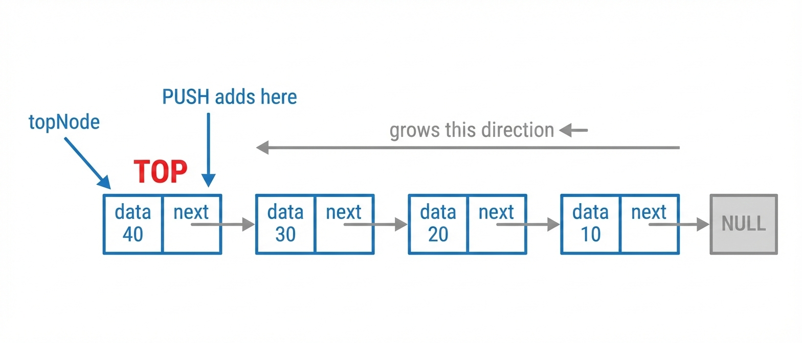

# Modul 05: Stack

**Mata Kuliah:** Struktur Data dan Algoritma  
**Kode:** SDA201  
**SKS:** 3 SKS (2 Teori + 1 Praktikum)  
**Pertemuan:** 05  
**Topik:** Stack

> **Capaian Pembelajaran:** Sub-CPMK-2.2 — Mampu mengimplementasikan stack dengan array dan linked list serta aplikasinya

**Estimasi Waktu Belajar:** 7 jam

**Referensi Utama:** Cormen Ch.10.1; Weiss Ch.3.6; Hubbard Ch.5

---

## Tujuan Pembelajaran

Setelah mempelajari modul ini, mahasiswa diharapkan mampu:

1. **Menjelaskan** konsep LIFO (Last-In-First-Out) dan karakteristik stack
2. **Mendefinisikan** Abstract Data Type (ADT) stack beserta operasi-operasinya
3. **Mengimplementasikan** stack menggunakan array (statis dan dinamis)
4. **Mengimplementasikan** stack menggunakan linked list
5. **Menganalisis** kompleksitas waktu dan ruang setiap operasi stack
6. **Menerapkan** stack untuk pengecekan balanced parentheses
7. **Menerapkan** stack untuk konversi dan evaluasi ekspresi aritmatika

---

## 1. Konsep Dasar Stack

### 1.1 Definisi Stack

> **Stack** adalah struktur data linear yang mengikuti prinsip **LIFO (Last-In-First-Out)**, di mana elemen yang terakhir dimasukkan akan menjadi elemen pertama yang dikeluarkan.

Bayangkan setumpuk piring di dapur—piring yang terakhir diletakkan di atas akan menjadi piring pertama yang diambil. Inilah esensi dari stack.

### 1.2 Analogi Dunia Nyata

Stack dapat ditemukan dalam berbagai situasi sehari-hari:

| Analogi | Penjelasan |
|---------|------------|
| Tumpukan piring | Piring teratas diambil pertama |
| Tumpukan buku | Buku di atas diambil lebih dulu |
| Undo di text editor | Aksi terakhir di-undo pertama |
| Browser back button | Halaman terakhir dikunjungi kembali pertama |
| Call stack program | Fungsi terakhir dipanggil, selesai pertama |

### 1.3 Konteks Militer

Dalam operasi militer, konsep stack sangat relevan:

- **Sistem komando darurat**: Perintah terakhir yang masuk memiliki prioritas tertinggi untuk dibatalkan
- **Log radar**: Data radar terbaru perlu diakses dengan cepat untuk analisis situasi terkini
- **Manajemen waypoint UAV**: Pilot dapat membatalkan waypoint terakhir yang dimasukkan


*Gambar 1.1: Ilustrasi Konsep LIFO pada Stack*


---

## 2. Abstract Data Type (ADT) Stack

### 2.1 Definisi ADT Stack

> **ADT Stack** mendefinisikan stack sebagai kumpulan elemen dengan operasi yang terbatas pada satu ujung yang disebut **top**.

### 2.2 Operasi Dasar Stack

| Operasi | Deskripsi | Return Value |
|---------|-----------|--------------|
| `push(x)` | Menambahkan elemen x ke top stack | void |
| `pop()` | Menghapus dan mengembalikan elemen top | elemen |
| `peek()` / `top()` | Mengembalikan elemen top tanpa menghapus | elemen |
| `isEmpty()` | Memeriksa apakah stack kosong | boolean |
| `isFull()` | Memeriksa apakah stack penuh (untuk array) | boolean |
| `size()` | Mengembalikan jumlah elemen dalam stack | integer |

### 2.3 Precondition dan Postcondition

```
push(x):
    Precondition  : Stack tidak penuh (untuk implementasi array fixed)
    Postcondition : x menjadi elemen top, size bertambah 1

pop():
    Precondition  : Stack tidak kosong
    Postcondition : Elemen top dihapus, size berkurang 1, return elemen yang dihapus

peek():
    Precondition  : Stack tidak kosong
    Postcondition : Stack tidak berubah, return elemen top
```


*Gambar 2.1: Visualisasi Operasi Push dan Pop pada Stack*


---

### SOLVED PROBLEM 1 ⭐
**Soal:** Diberikan stack kosong S. Setelah operasi berikut dilakukan, apa isi stack dan nilai yang dikembalikan oleh setiap operasi pop?

```
push(5), push(10), push(15), pop(), push(20), pop(), pop()
```

**Penyelesaian:**

Mari trace langkah per langkah:

| Langkah | Operasi | Stack (bottom→top) | Return |
|---------|---------|-------------------|--------|
| 1 | push(5) | [5] | - |
| 2 | push(10) | [5, 10] | - |
| 3 | push(15) | [5, 10, 15] | - |
| 4 | pop() | [5, 10] | 15 |
| 5 | push(20) | [5, 10, 20] | - |
| 6 | pop() | [5, 10] | 20 |
| 7 | pop() | [5] | 10 |

**Hasil akhir:** Stack berisi [5], nilai yang dikembalikan pop: 15, 20, 10

---

### SOLVED PROBLEM 2 ⭐
**Soal:** Jelaskan perbedaan antara operasi `pop()` dan `peek()`.

**Penyelesaian:**

| Aspek | pop() | peek() |
|-------|-------|--------|
| Fungsi | Menghapus dan mengembalikan elemen top | Hanya mengembalikan elemen top |
| Perubahan stack | Stack berkurang 1 elemen | Stack tidak berubah |
| Penggunaan | Ketika elemen perlu dikeluarkan | Ketika hanya ingin melihat tanpa menghapus |

Contoh:
```cpp
// Stack: [1, 2, 3] dengan top = 3
int x = stack.peek();  // x = 3, Stack tetap [1, 2, 3]
int y = stack.pop();   // y = 3, Stack menjadi [1, 2]
```

---

## 3. Implementasi Stack dengan Array

### 3.1 Implementasi Array Statis

Implementasi menggunakan array dengan ukuran tetap (fixed size).

```cpp
#include <iostream>
using namespace std;

class StackArray {
private:
    static const int MAX_SIZE = 100;
    int data[MAX_SIZE];
    int topIndex;  // Index elemen top, -1 jika kosong
    
public:
    // Constructor
    StackArray() : topIndex(-1) {}
    
    // Memeriksa apakah stack kosong
    bool isEmpty() {
        return topIndex == -1;
    }
    
    // Memeriksa apakah stack penuh
    bool isFull() {
        return topIndex == MAX_SIZE - 1;
    }
    
    // Menambahkan elemen ke stack
    void push(int value) {
        if (isFull()) {
            cout << "Error: Stack Overflow!" << endl;
            return;
        }
        data[++topIndex] = value;
    }
    
    // Menghapus dan mengembalikan elemen top
    int pop() {
        if (isEmpty()) {
            cout << "Error: Stack Underflow!" << endl;
            return -1;  // atau throw exception
        }
        return data[topIndex--];
    }
    
    // Mengembalikan elemen top tanpa menghapus
    int peek() {
        if (isEmpty()) {
            cout << "Error: Stack kosong!" << endl;
            return -1;
        }
        return data[topIndex];
    }
    
    // Mengembalikan jumlah elemen
    int size() {
        return topIndex + 1;
    }
    
    // Menampilkan isi stack
    void display() {
        if (isEmpty()) {
            cout << "Stack kosong" << endl;
            return;
        }
        cout << "Stack (bottom to top): ";
        for (int i = 0; i <= topIndex; i++) {
            cout << data[i] << " ";
        }
        cout << endl;
    }
};
```


*Gambar 3.1: Layout Memory untuk Implementasi Stack dengan Array*


### 3.2 Analisis Kompleksitas Array Statis

| Operasi | Time Complexity | Space Complexity |
|---------|-----------------|------------------|
| push() | O(1) | O(1) |
| pop() | O(1) | O(1) |
| peek() | O(1) | O(1) |
| isEmpty() | O(1) | O(1) |
| isFull() | O(1) | O(1) |
| **Total Space** | - | O(n) untuk n elemen |

**Keuntungan:**
- Implementasi sederhana
- Akses langsung O(1) ke top
- Cache-friendly (elemen berurutan di memori)

**Kekurangan:**
- Ukuran tetap, tidak fleksibel
- Potensi waste memory jika tidak terpakai penuh
- Stack overflow jika melebihi kapasitas

---

### SOLVED PROBLEM 3 ⭐
**Soal:** Pada implementasi stack dengan array, mengapa `topIndex` diinisialisasi dengan -1?

**Penyelesaian:**

`topIndex = -1` menandakan bahwa stack dalam keadaan kosong. Alasannya:

1. **Konsistensi indeks:** Array dimulai dari indeks 0, sehingga -1 berarti "tidak ada elemen"
2. **Kemudahan operasi push:** Ketika push pertama, `++topIndex` akan menghasilkan 0 (indeks pertama)
3. **Penghitungan size:** `size = topIndex + 1`, jadi jika topIndex = -1, size = 0

```cpp
// Kondisi awal: topIndex = -1
push(10);  // topIndex menjadi 0, data[0] = 10
push(20);  // topIndex menjadi 1, data[1] = 20
```

---

### 3.3 Implementasi Array Dinamis

Untuk mengatasi keterbatasan ukuran tetap, kita dapat menggunakan array dinamis yang dapat di-resize.

```cpp
#include <iostream>
using namespace std;

class DynamicStack {
private:
    int* data;
    int topIndex;
    int capacity;
    
    // Fungsi untuk memperbesar kapasitas (doubling strategy)
    void resize() {
        int newCapacity = capacity * 2;
        int* newData = new int[newCapacity];
        
        // Copy data lama ke array baru
        for (int i = 0; i <= topIndex; i++) {
            newData[i] = data[i];
        }
        
        delete[] data;  // Hapus array lama
        data = newData;
        capacity = newCapacity;
        
        cout << "Stack di-resize ke kapasitas " << capacity << endl;
    }
    
public:
    // Constructor dengan kapasitas awal
    DynamicStack(int initialCapacity = 4) {
        capacity = initialCapacity;
        data = new int[capacity];
        topIndex = -1;
    }
    
    // Destructor
    ~DynamicStack() {
        delete[] data;
    }
    
    bool isEmpty() {
        return topIndex == -1;
    }
    
    void push(int value) {
        // Jika penuh, resize dulu
        if (topIndex == capacity - 1) {
            resize();
        }
        data[++topIndex] = value;
    }
    
    int pop() {
        if (isEmpty()) {
            cout << "Error: Stack Underflow!" << endl;
            return -1;
        }
        return data[topIndex--];
    }
    
    int peek() {
        if (isEmpty()) {
            cout << "Error: Stack kosong!" << endl;
            return -1;
        }
        return data[topIndex];
    }
    
    int size() {
        return topIndex + 1;
    }
    
    int getCapacity() {
        return capacity;
    }
};
```

### 3.4 Amortized Analysis untuk Dynamic Array

Ketika menggunakan **doubling strategy** (kapasitas dilipatgandakan saat penuh):

- **Worst case single push:** O(n) saat resize
- **Amortized push:** O(1)

**Analisis:**

Misalkan kita melakukan n operasi push dimulai dari kapasitas 1:
- Resize terjadi saat size = 1, 2, 4, 8, ..., n
- Total copy = 1 + 2 + 4 + 8 + ... + n = 2n - 1 ≈ 2n
- Rata-rata per operasi = 2n / n = 2 = O(1)

---

### SOLVED PROBLEM 4 ⭐⭐
**Soal:** Jelaskan mengapa doubling strategy lebih efisien daripada increment by 1 strategy untuk dynamic array.

**Penyelesaian:**

**Strategi Increment by 1:**
- Setiap push saat penuh memerlukan copy semua n elemen
- Untuk n operasi push: 0 + 1 + 2 + 3 + ... + (n-1) = n(n-1)/2 = O(n²) total
- Rata-rata per operasi: O(n)

**Strategi Doubling:**
- Resize terjadi hanya saat kapasitas = 1, 2, 4, 8, ...
- Total copy untuk n operasi: 1 + 2 + 4 + ... ≈ 2n
- Rata-rata per operasi (amortized): O(1)

| Strategi | Total untuk n push | Amortized per push |
|----------|-------------------|-------------------|
| Increment by 1 | O(n²) | O(n) |
| Doubling | O(n) | O(1) |

**Kesimpulan:** Doubling strategy 10x lebih efisien untuk n=10, 100x untuk n=100, dst.

---

## 4. Implementasi Stack dengan Linked List

### 4.1 Struktur Node

```cpp
struct Node {
    int data;
    Node* next;
    
    Node(int value) : data(value), next(nullptr) {}
};
```

### 4.2 Implementasi Lengkap

```cpp
#include <iostream>
using namespace std;

struct Node {
    int data;
    Node* next;
    
    Node(int value) : data(value), next(nullptr) {}
};

class StackLinkedList {
private:
    Node* topNode;
    int count;
    
public:
    // Constructor
    StackLinkedList() : topNode(nullptr), count(0) {}
    
    // Destructor - penting untuk mencegah memory leak
    ~StackLinkedList() {
        while (!isEmpty()) {
            pop();
        }
    }
    
    bool isEmpty() {
        return topNode == nullptr;
    }
    
    // Push: tambahkan node baru di depan (menjadi top)
    void push(int value) {
        Node* newNode = new Node(value);
        newNode->next = topNode;  // Node baru menunjuk ke top lama
        topNode = newNode;        // Update top ke node baru
        count++;
    }
    
    // Pop: hapus node top dan kembalikan nilainya
    int pop() {
        if (isEmpty()) {
            cout << "Error: Stack Underflow!" << endl;
            return -1;
        }
        
        Node* temp = topNode;
        int value = temp->data;
        topNode = topNode->next;  // Update top ke node berikutnya
        delete temp;              // Hapus node lama
        count--;
        
        return value;
    }
    
    int peek() {
        if (isEmpty()) {
            cout << "Error: Stack kosong!" << endl;
            return -1;
        }
        return topNode->data;
    }
    
    int size() {
        return count;
    }
    
    void display() {
        if (isEmpty()) {
            cout << "Stack kosong" << endl;
            return;
        }
        
        cout << "Stack (top to bottom): ";
        Node* current = topNode;
        while (current != nullptr) {
            cout << current->data << " -> ";
            current = current->next;
        }
        cout << "NULL" << endl;
    }
};
```



*Gambar 4.1: Struktur Stack dengan Implementasi Linked List*


### 4.3 Analisis Kompleksitas Linked List

| Operasi | Time Complexity | Space Complexity |
|---------|-----------------|------------------|
| push() | O(1) | O(1) per operasi |
| pop() | O(1) | O(1) |
| peek() | O(1) | O(1) |
| isEmpty() | O(1) | O(1) |
| **Total Space** | - | O(n) untuk n elemen |

**Keuntungan:**
- Tidak ada batasan ukuran (selama memori tersedia)
- Tidak ada waste memory untuk elemen tidak terpakai
- Tidak perlu resize

**Kekurangan:**
- Overhead pointer di setiap node (8 byte pada sistem 64-bit)
- Tidak cache-friendly (node tersebar di memori)
- Perlu alokasi/dealokasi memori untuk setiap push/pop

---

### SOLVED PROBLEM 5 ⭐⭐
**Soal:** Mengapa pada implementasi stack dengan linked list, operasi push dan pop dilakukan di depan (head) dan bukan di belakang (tail)?

**Penyelesaian:**

Operasi di **head** memiliki kompleksitas O(1) karena kita selalu memiliki pointer langsung ke head.

Jika menggunakan **tail**:
- Push di tail: O(1) jika ada tail pointer
- Pop di tail: **O(n)** karena harus traverse untuk menemukan node sebelum tail


*Gambar 4.2: Mengapa Operasi Pop di Tail Membutuhkan O(n)*


**Langkah-langkah pop di tail:**
1. Mulai dari head (A)
2. Traverse sampai menemukan node sebelum tail (C) → **O(n)**
3. Set C→next = NULL
4. Update tail = C
5. Delete D

Dengan menggunakan head sebagai top:
- Push: O(1) - tambah node baru, arahkan ke head lama, update head
- Pop: O(1) - simpan head, pindah head ke next, hapus node lama

---

## 5. Perbandingan Implementasi Array vs Linked List

### SOLVED PROBLEM 6 ⭐⭐
**Soal:** Bandingkan implementasi stack menggunakan array dan linked list dari berbagai aspek.

**Penyelesaian:**

| Aspek | Array (Static) | Array (Dynamic) | Linked List |
|-------|---------------|-----------------|-------------|
| **Ukuran** | Tetap | Fleksibel | Fleksibel |
| **Push** | O(1) | O(1) amortized | O(1) |
| **Pop** | O(1) | O(1) | O(1) |
| **Memory** | Boros jika tidak penuh | Lebih efisien | Overhead pointer |
| **Cache** | Friendly | Friendly | Tidak friendly |
| **Overflow** | Mungkin terjadi | Tidak (auto resize) | Tidak |
| **Implementasi** | Sederhana | Menengah | Menengah |

**Rekomendasi Penggunaan:**

- **Array Static:** Ketika ukuran maksimum diketahui dan tetap
- **Array Dynamic:** General purpose, keseimbangan antara performa dan fleksibilitas
- **Linked List:** Ketika ukuran sangat bervariasi atau memory sangat terbatas

---

## 6. Aplikasi Stack: Balanced Parentheses

### 6.1 Deskripsi Masalah

> Diberikan string yang berisi tanda kurung `()`, `[]`, `{}`, tentukan apakah string tersebut memiliki tanda kurung yang **balanced** (seimbang).

**Aturan balanced:**
1. Setiap kurung buka harus memiliki kurung tutup yang sesuai
2. Kurung tutup harus menutup kurung buka dengan tipe yang sama
3. Urutan harus benar (kurung dalam harus ditutup dulu)

**Contoh:**
- `"([]){}"` → **Balanced** ✓
- `"([)]"` → **Tidak Balanced** ✗
- `"((("` → **Tidak Balanced** ✗

### 6.2 Algoritma

```
Algoritma CheckBalanced(expr):
    1. Buat stack kosong
    2. Untuk setiap karakter c dalam expr:
        a. Jika c adalah kurung buka ('(', '[', '{'):
           - Push c ke stack
        b. Jika c adalah kurung tutup (')', ']', '}'):
           - Jika stack kosong, return FALSE
           - Pop elemen dari stack
           - Jika elemen tidak match dengan c, return FALSE
    3. Jika stack kosong, return TRUE
       Jika tidak, return FALSE
```

### 6.3 Implementasi C++

```cpp
#include <iostream>
#include <stack>
#include <string>
using namespace std;

bool isMatchingPair(char open, char close) {
    return (open == '(' && close == ')') ||
           (open == '[' && close == ']') ||
           (open == '{' && close == '}');
}

bool isBalanced(string expr) {
    stack<char> s;
    
    for (char c : expr) {
        // Jika kurung buka, push ke stack
        if (c == '(' || c == '[' || c == '{') {
            s.push(c);
        }
        // Jika kurung tutup
        else if (c == ')' || c == ']' || c == '}') {
            // Stack kosong berarti tidak ada pasangan
            if (s.empty()) {
                return false;
            }
            
            // Cek apakah match
            char top = s.top();
            s.pop();
            
            if (!isMatchingPair(top, c)) {
                return false;
            }
        }
        // Karakter lain diabaikan
    }
    
    // Stack harus kosong di akhir
    return s.empty();
}

int main() {
    string test1 = "([]){}";
    string test2 = "([)]";
    string test3 = "{[()]}";
    
    cout << test1 << " : " << (isBalanced(test1) ? "Balanced" : "Not Balanced") << endl;
    cout << test2 << " : " << (isBalanced(test2) ? "Balanced" : "Not Balanced") << endl;
    cout << test3 << " : " << (isBalanced(test3) ? "Balanced" : "Not Balanced") << endl;
    
    return 0;
}
```

**Output:**
```
([]){}  : Balanced
([)]    : Not Balanced
{[()]}  : Balanced
```


*Gambar 6.1: Trace Algoritma Balanced Parentheses untuk "{[()]}"*


---

### SOLVED PROBLEM 7 ⭐
**Soal:** Trace algoritma balanced parentheses untuk string `"[(])"`.

**Penyelesaian:**

| Langkah | Karakter | Aksi | Stack | Keterangan |
|---------|----------|------|-------|------------|
| 1 | `[` | push | `[` | Kurung buka |
| 2 | `(` | push | `[(` | Kurung buka |
| 3 | `]` | pop & check | `[` | Pop `(`, cek match dengan `]` |
| - | - | - | - | `(` tidak match dengan `]` → **NOT BALANCED** |

**Hasil:** String `"[(])"` adalah **NOT BALANCED** karena `(` tidak cocok dengan `]`.

---

### SOLVED PROBLEM 8 ⭐⭐
**Soal:** Modifikasi algoritma balanced parentheses untuk juga menangani karakter HTML tag sederhana seperti `<div>` dan `</div>`.

**Penyelesaian:**

```cpp
#include <iostream>
#include <stack>
#include <string>
using namespace std;

bool isBalancedHTML(string html) {
    stack<string> s;
    int i = 0;
    
    while (i < html.length()) {
        // Cari tag pembuka atau penutup
        if (html[i] == '<') {
            int j = i + 1;
            bool isClosing = false;
            
            // Cek apakah tag penutup
            if (j < html.length() && html[j] == '/') {
                isClosing = true;
                j++;
            }
            
            // Ekstrak nama tag
            string tagName = "";
            while (j < html.length() && html[j] != '>') {
                tagName += html[j];
                j++;
            }
            
            if (isClosing) {
                // Tag penutup
                if (s.empty() || s.top() != tagName) {
                    return false;
                }
                s.pop();
            } else {
                // Tag pembuka
                s.push(tagName);
            }
            
            i = j + 1;
        } else {
            i++;
        }
    }
    
    return s.empty();
}

int main() {
    cout << isBalancedHTML("<div><p></p></div>") << endl;  // 1 (true)
    cout << isBalancedHTML("<div><p></div></p>") << endl;  // 0 (false)
    return 0;
}
```

---

## 7. Aplikasi Stack: Konversi Ekspresi

### 7.1 Notasi Ekspresi

| Notasi | Format | Contoh |
|--------|--------|--------|
| **Infix** | operand operator operand | `A + B` |
| **Prefix** (Polish) | operator operand operand | `+ A B` |
| **Postfix** (Reverse Polish) | operand operand operator | `A B +` |

**Mengapa Postfix penting?**
1. Tidak memerlukan tanda kurung
2. Tidak memerlukan aturan prioritas saat evaluasi
3. Mudah dievaluasi dengan stack (digunakan di kalkulator dan compiler)

### 7.2 Prioritas Operator

| Operator | Prioritas | Associativity |
|----------|-----------|---------------|
| `^` | 3 (tertinggi) | Right to Left |
| `*`, `/` | 2 | Left to Right |
| `+`, `-` | 1 (terendah) | Left to Right |

### 7.3 Algoritma Infix ke Postfix (Shunting-Yard)

```
Algoritma InfixToPostfix(infix):
    1. Buat stack kosong untuk operator
    2. Buat string output kosong
    3. Untuk setiap token dalam infix:
        a. Jika token adalah operand:
           - Tambahkan ke output
        b. Jika token adalah '(':
           - Push ke stack
        c. Jika token adalah ')':
           - Pop dan tambahkan ke output sampai '(' ditemukan
           - Pop '(' tapi jangan tambahkan ke output
        d. Jika token adalah operator:
           - Selama stack tidak kosong DAN
             top stack bukan '(' DAN
             (prioritas top >= prioritas token ATAU
              prioritas sama dan left-associative):
             * Pop dan tambahkan ke output
           - Push token ke stack
    4. Pop semua operator yang tersisa ke output
    5. Return output
```

### 7.4 Implementasi Infix ke Postfix

```cpp
#include <iostream>
#include <stack>
#include <string>
#include <cctype>
using namespace std;

int getPriority(char op) {
    if (op == '^') return 3;
    if (op == '*' || op == '/') return 2;
    if (op == '+' || op == '-') return 1;
    return 0;
}

bool isLeftAssociative(char op) {
    return op != '^';  // Hanya ^ yang right associative
}

bool isOperator(char c) {
    return c == '+' || c == '-' || c == '*' || c == '/' || c == '^';
}

string infixToPostfix(string infix) {
    stack<char> opStack;
    string postfix = "";
    
    for (char token : infix) {
        // Skip spasi
        if (token == ' ') continue;
        
        // Jika operand (huruf atau angka)
        if (isalnum(token)) {
            postfix += token;
        }
        // Jika kurung buka
        else if (token == '(') {
            opStack.push(token);
        }
        // Jika kurung tutup
        else if (token == ')') {
            while (!opStack.empty() && opStack.top() != '(') {
                postfix += opStack.top();
                opStack.pop();
            }
            if (!opStack.empty()) {
                opStack.pop();  // Pop '('
            }
        }
        // Jika operator
        else if (isOperator(token)) {
            while (!opStack.empty() && 
                   opStack.top() != '(' &&
                   (getPriority(opStack.top()) > getPriority(token) ||
                    (getPriority(opStack.top()) == getPriority(token) && 
                     isLeftAssociative(token)))) {
                postfix += opStack.top();
                opStack.pop();
            }
            opStack.push(token);
        }
    }
    
    // Pop sisa operator
    while (!opStack.empty()) {
        postfix += opStack.top();
        opStack.pop();
    }
    
    return postfix;
}

int main() {
    cout << "A+B*C      -> " << infixToPostfix("A+B*C") << endl;
    cout << "(A+B)*C    -> " << infixToPostfix("(A+B)*C") << endl;
    cout << "A+B*C-D/E  -> " << infixToPostfix("A+B*C-D/E") << endl;
    cout << "A^B^C      -> " << infixToPostfix("A^B^C") << endl;
    
    return 0;
}
```

**Output:**
```
A+B*C      -> ABC*+
(A+B)*C    -> AB+C*
A+B*C-D/E  -> ABC*+DE/-
A^B^C      -> ABC^^
```


*Gambar 7.1: Trace Konversi Infix ke Postfix untuk "(A+B)*C"*


---

### SOLVED PROBLEM 9 ⭐⭐
**Soal:** Konversi ekspresi infix `A*(B+C)/D-E` ke postfix menggunakan algoritma Shunting-Yard. Tunjukkan trace langkah per langkah.

**Penyelesaian:**

| Langkah | Token | Aksi | Stack | Output |
|---------|-------|------|-------|--------|
| 1 | A | Output operand | | A |
| 2 | * | Push operator | * | A |
| 3 | ( | Push kurung | *( | A |
| 4 | B | Output operand | *( | AB |
| 5 | + | Push operator | *(+ | AB |
| 6 | C | Output operand | *(+ | ABC |
| 7 | ) | Pop sampai '(' | * | ABC+ |
| 8 | / | Pop *, push / | / | ABC+* |
| 9 | D | Output operand | / | ABC+*D |
| 10 | - | Pop /, push - | - | ABC+*D/ |
| 11 | E | Output operand | - | ABC+*D/E |
| 12 | END | Pop semua | | ABC+*D/E- |

**Hasil:** `ABC+*D/E-`

---

## 8. Aplikasi Stack: Evaluasi Ekspresi Postfix

### 8.1 Algoritma

```
Algoritma EvaluatePostfix(postfix):
    1. Buat stack kosong untuk operand
    2. Untuk setiap token dalam postfix:
        a. Jika token adalah operand (angka):
           - Push ke stack
        b. Jika token adalah operator:
           - Pop dua operand dari stack (op2 = pop, op1 = pop)
           - Hitung: result = op1 operator op2
           - Push result ke stack
    3. Return nilai di top stack (hasil akhir)
```

### 8.2 Implementasi

```cpp
#include <iostream>
#include <stack>
#include <string>
#include <cctype>
#include <cmath>
using namespace std;

int evaluatePostfix(string postfix) {
    stack<int> operandStack;
    
    for (char token : postfix) {
        // Skip spasi
        if (token == ' ') continue;
        
        // Jika operand (digit)
        if (isdigit(token)) {
            operandStack.push(token - '0');  // Convert char to int
        }
        // Jika operator
        else {
            int op2 = operandStack.top(); operandStack.pop();
            int op1 = operandStack.top(); operandStack.pop();
            int result;
            
            switch (token) {
                case '+': result = op1 + op2; break;
                case '-': result = op1 - op2; break;
                case '*': result = op1 * op2; break;
                case '/': result = op1 / op2; break;
                case '^': result = pow(op1, op2); break;
                default: result = 0;
            }
            
            operandStack.push(result);
        }
    }
    
    return operandStack.top();
}

int main() {
    cout << "23*5+ = " << evaluatePostfix("23*5+") << endl;    // 2*3+5 = 11
    cout << "234*+ = " << evaluatePostfix("234*+") << endl;    // 2+3*4 = 14
    cout << "82/3- = " << evaluatePostfix("82/3-") << endl;    // 8/2-3 = 1
    cout << "23^   = " << evaluatePostfix("23^") << endl;      // 2^3 = 8
    
    return 0;
}
```


*Gambar 8.1: Trace Evaluasi Ekspresi Postfix "23*5+"*


---

### SOLVED PROBLEM 10 ⭐
**Soal:** Evaluasi ekspresi postfix `5 3 + 2 * 4 -`. Tunjukkan trace langkah per langkah.

**Penyelesaian:**

| Langkah | Token | Aksi | Stack | Keterangan |
|---------|-------|------|-------|------------|
| 1 | 5 | Push | [5] | Operand |
| 2 | 3 | Push | [5, 3] | Operand |
| 3 | + | Pop 3,5; Hitung; Push | [8] | 5 + 3 = 8 |
| 4 | 2 | Push | [8, 2] | Operand |
| 5 | * | Pop 2,8; Hitung; Push | [16] | 8 * 2 = 16 |
| 6 | 4 | Push | [16, 4] | Operand |
| 7 | - | Pop 4,16; Hitung; Push | [12] | 16 - 4 = 12 |

**Hasil:** `12`

Ekspresi infix yang setara: `(5 + 3) * 2 - 4 = 8 * 2 - 4 = 16 - 4 = 12` ✓

---

### SOLVED PROBLEM 11 ⭐⭐
**Soal:** Tuliskan fungsi untuk mengkonversi ekspresi infix ke prefix.

**Penyelesaian:**

**Algoritma:**
1. Reverse string infix (dan tukar '(' dengan ')' dan sebaliknya)
2. Konversi ke postfix menggunakan Shunting-Yard yang dimodifikasi
3. Reverse hasil untuk mendapatkan prefix

```cpp
#include <iostream>
#include <stack>
#include <string>
#include <algorithm>
using namespace std;

int getPriority(char op) {
    if (op == '^') return 3;
    if (op == '*' || op == '/') return 2;
    if (op == '+' || op == '-') return 1;
    return 0;
}

bool isOperator(char c) {
    return c == '+' || c == '-' || c == '*' || c == '/' || c == '^';
}

string infixToPrefix(string infix) {
    // Step 1: Reverse dan swap parentheses
    reverse(infix.begin(), infix.end());
    for (int i = 0; i < infix.length(); i++) {
        if (infix[i] == '(') infix[i] = ')';
        else if (infix[i] == ')') infix[i] = '(';
    }
    
    // Step 2: Modifikasi Shunting-Yard (right-to-left associativity)
    stack<char> opStack;
    string result = "";
    
    for (char token : infix) {
        if (isalnum(token)) {
            result += token;
        }
        else if (token == '(') {
            opStack.push(token);
        }
        else if (token == ')') {
            while (!opStack.empty() && opStack.top() != '(') {
                result += opStack.top();
                opStack.pop();
            }
            if (!opStack.empty()) opStack.pop();
        }
        else if (isOperator(token)) {
            // Untuk prefix, gunakan >= bukan > (untuk right associativity)
            while (!opStack.empty() && 
                   opStack.top() != '(' &&
                   getPriority(opStack.top()) > getPriority(token)) {
                result += opStack.top();
                opStack.pop();
            }
            opStack.push(token);
        }
    }
    
    while (!opStack.empty()) {
        result += opStack.top();
        opStack.pop();
    }
    
    // Step 3: Reverse hasil
    reverse(result.begin(), result.end());
    
    return result;
}

int main() {
    cout << "A+B*C   -> " << infixToPrefix("A+B*C") << endl;    // +A*BC
    cout << "(A+B)*C -> " << infixToPrefix("(A+B)*C") << endl;  // *+ABC
    
    return 0;
}
```

---

## 9. Aplikasi Stack: Function Call Stack

### 9.1 Konsep Function Call Stack

Setiap kali fungsi dipanggil, sistem membuat **stack frame** yang berisi:
- Parameter fungsi
- Variabel lokal
- Return address (alamat kembali)

Stack frame di-push saat fungsi dipanggil dan di-pop saat fungsi selesai (return).


*Gambar 9.1: Function Call Stack untuk Rekursi factorial(4)*


### 9.2 Contoh: Tracing Rekursi Faktorial

```cpp
int factorial(int n) {
    if (n <= 1) return 1;           // Base case
    return n * factorial(n - 1);    // Recursive case
}

// Pemanggilan: factorial(4)
```

**Trace Call Stack:**


*Gambar 9.2: Trace Call Stack untuk factorial(4) - Push dan Pop Phase*


| Phase | Langkah | Aksi | Stack State | Return |
|-------|---------|------|-------------|--------|
| PUSH | 1 | factorial(4) dipanggil | [f(4)] | - |
| PUSH | 2 | factorial(3) dipanggil | [f(4), f(3)] | - |
| PUSH | 3 | factorial(2) dipanggil | [f(4), f(3), f(2)] | - |
| PUSH | 4 | factorial(1) dipanggil | [f(4), f(3), f(2), f(1)] | - |
| POP | 5 | factorial(1) selesai | [f(4), f(3), f(2)] | 1 |
| POP | 6 | factorial(2) = 2×1 | [f(4), f(3)] | 2 |
| POP | 7 | factorial(3) = 3×2 | [f(4)] | 6 |
| POP | 8 | factorial(4) = 4×6 | [] | **24** |

---

### SOLVED PROBLEM 12 ⭐⭐
**Soal:** Apa yang terjadi jika rekursi tidak memiliki base case yang tepat? Hubungkan dengan konsep stack.

**Penyelesaian:**

Jika rekursi tidak memiliki base case yang tepat, akan terjadi **stack overflow**:

1. **Tanpa base case:** Fungsi terus memanggil dirinya sendiri tanpa berhenti
2. **Stack terus bertambah:** Setiap pemanggilan menambah frame baru ke call stack
3. **Memory habis:** Stack memiliki batas ukuran (biasanya beberapa MB)
4. **Stack overflow error:** Program crash dengan error "Stack Overflow"

**Contoh buruk:**
```cpp
int infiniteRecursion(int n) {
    // Tidak ada base case!
    return infiniteRecursion(n + 1);
}
```

**Perbaikan:**
```cpp
int finiteRecursion(int n) {
    if (n >= 10) return n;  // Base case
    return finiteRecursion(n + 1);
}
```

**Hubungan dengan stack:**
- Call stack memiliki batas ukuran terbatas
- Setiap pemanggilan rekursif menggunakan memory
- Base case memastikan rekursi berhenti dan stack di-pop

---

## 10. Aplikasi Stack: Undo Mechanism

### SOLVED PROBLEM 13 ⭐⭐⭐
**Soal:** Implementasikan sistem undo/redo sederhana menggunakan dua stack untuk text editor.

**Penyelesaian:**

```cpp
#include <iostream>
#include <stack>
#include <string>
using namespace std;

class TextEditor {
private:
    string currentText;
    stack<string> undoStack;    // Menyimpan state sebelumnya
    stack<string> redoStack;    // Menyimpan state yang di-undo
    
public:
    TextEditor() : currentText("") {}
    
    // Menambahkan teks
    void write(string text) {
        // Simpan state sekarang ke undo stack
        undoStack.push(currentText);
        // Clear redo stack (aksi baru menghapus redo history)
        while (!redoStack.empty()) redoStack.pop();
        // Update teks
        currentText += text;
        cout << "Wrote: \"" << text << "\"" << endl;
    }
    
    // Undo aksi terakhir
    void undo() {
        if (undoStack.empty()) {
            cout << "Nothing to undo!" << endl;
            return;
        }
        // Simpan state sekarang ke redo stack
        redoStack.push(currentText);
        // Restore state sebelumnya
        currentText = undoStack.top();
        undoStack.pop();
        cout << "Undo performed" << endl;
    }
    
    // Redo aksi yang di-undo
    void redo() {
        if (redoStack.empty()) {
            cout << "Nothing to redo!" << endl;
            return;
        }
        // Simpan state sekarang ke undo stack
        undoStack.push(currentText);
        // Restore state dari redo
        currentText = redoStack.top();
        redoStack.pop();
        cout << "Redo performed" << endl;
    }
    
    // Menampilkan teks saat ini
    void display() {
        cout << "Current text: \"" << currentText << "\"" << endl;
    }
};

int main() {
    TextEditor editor;
    
    editor.write("Hello ");
    editor.display();           // "Hello "
    
    editor.write("World");
    editor.display();           // "Hello World"
    
    editor.write("!");
    editor.display();           // "Hello World!"
    
    editor.undo();
    editor.display();           // "Hello World"
    
    editor.undo();
    editor.display();           // "Hello "
    
    editor.redo();
    editor.display();           // "Hello World"
    
    editor.write(" - New");     // Menghapus redo history
    editor.display();           // "Hello World - New"
    
    editor.redo();              // Nothing to redo!
    
    return 0;
}
```

---

## 11. Aplikasi Stack: Browser History

### SOLVED PROBLEM 14 ⭐⭐
**Soal:** Implementasikan simulasi browser history menggunakan stack untuk fitur back dan forward.

**Penyelesaian:**

```cpp
#include <iostream>
#include <stack>
#include <string>
using namespace std;

class BrowserHistory {
private:
    string currentPage;
    stack<string> backStack;
    stack<string> forwardStack;
    
public:
    BrowserHistory(string homepage) : currentPage(homepage) {
        cout << "Homepage: " << homepage << endl;
    }
    
    void visit(string url) {
        // Simpan halaman saat ini ke back stack
        backStack.push(currentPage);
        // Clear forward stack (kunjungan baru menghapus forward history)
        while (!forwardStack.empty()) forwardStack.pop();
        // Pindah ke halaman baru
        currentPage = url;
        cout << "Visiting: " << url << endl;
    }
    
    void back() {
        if (backStack.empty()) {
            cout << "Cannot go back further!" << endl;
            return;
        }
        // Simpan halaman saat ini ke forward stack
        forwardStack.push(currentPage);
        // Ambil halaman dari back stack
        currentPage = backStack.top();
        backStack.pop();
        cout << "Back to: " << currentPage << endl;
    }
    
    void forward() {
        if (forwardStack.empty()) {
            cout << "Cannot go forward!" << endl;
            return;
        }
        // Simpan halaman saat ini ke back stack
        backStack.push(currentPage);
        // Ambil halaman dari forward stack
        currentPage = forwardStack.top();
        forwardStack.pop();
        cout << "Forward to: " << currentPage << endl;
    }
    
    void showCurrent() {
        cout << "Current page: " << currentPage << endl;
    }
};

int main() {
    BrowserHistory browser("google.com");
    
    browser.visit("youtube.com");
    browser.visit("facebook.com");
    browser.visit("twitter.com");
    browser.showCurrent();     // twitter.com
    
    browser.back();            // facebook.com
    browser.back();            // youtube.com
    browser.forward();         // facebook.com
    
    browser.visit("linkedin.com");  // Menghapus twitter.com dari forward
    browser.forward();         // Cannot go forward!
    
    browser.back();            // facebook.com
    
    return 0;
}
```

---

## 12. Soal Lanjutan

### SOLVED PROBLEM 15 ⭐⭐⭐
**Soal:** Implementasikan fungsi untuk mengecek apakah sebuah string adalah palindrome menggunakan stack.

**Penyelesaian:**

```cpp
#include <iostream>
#include <stack>
#include <string>
#include <cctype>
using namespace std;

bool isPalindrome(string str) {
    stack<char> s;
    string cleaned = "";
    
    // Bersihkan string: hanya huruf, lowercase
    for (char c : str) {
        if (isalpha(c)) {
            cleaned += tolower(c);
        }
    }
    
    // Push setengah pertama ke stack
    int mid = cleaned.length() / 2;
    for (int i = 0; i < mid; i++) {
        s.push(cleaned[i]);
    }
    
    // Tentukan starting point untuk perbandingan
    int start = mid;
    if (cleaned.length() % 2 == 1) {
        start = mid + 1;  // Skip karakter tengah jika ganjil
    }
    
    // Bandingkan setengah kedua dengan stack
    for (int i = start; i < cleaned.length(); i++) {
        if (s.empty() || s.top() != cleaned[i]) {
            return false;
        }
        s.pop();
    }
    
    return s.empty();
}

int main() {
    cout << "radar: " << (isPalindrome("radar") ? "Yes" : "No") << endl;
    cout << "A man a plan a canal Panama: " << 
            (isPalindrome("A man a plan a canal Panama") ? "Yes" : "No") << endl;
    cout << "hello: " << (isPalindrome("hello") ? "Yes" : "No") << endl;
    
    return 0;
}
```

**Output:**
```
radar: Yes
A man a plan a canal Panama: Yes
hello: No
```

---

### SOLVED PROBLEM 16 ⭐⭐⭐
**Soal:** Implementasikan fungsi untuk membalik elemen-elemen dalam stack tanpa menggunakan struktur data tambahan selain stack lain.

**Penyelesaian:**

```cpp
#include <iostream>
#include <stack>
using namespace std;

// Fungsi untuk memasukkan elemen di bottom stack
void insertAtBottom(stack<int>& s, int item) {
    if (s.empty()) {
        s.push(item);
        return;
    }
    
    int top = s.top();
    s.pop();
    insertAtBottom(s, item);
    s.push(top);
}

// Fungsi untuk membalik stack menggunakan rekursi
void reverseStack(stack<int>& s) {
    if (s.empty()) return;
    
    int top = s.top();
    s.pop();
    reverseStack(s);
    insertAtBottom(s, top);
}

void printStack(stack<int> s) {
    cout << "Stack (top to bottom): ";
    while (!s.empty()) {
        cout << s.top() << " ";
        s.pop();
    }
    cout << endl;
}

int main() {
    stack<int> s;
    s.push(1);
    s.push(2);
    s.push(3);
    s.push(4);
    
    cout << "Before reverse:" << endl;
    printStack(s);
    
    reverseStack(s);
    
    cout << "After reverse:" << endl;
    printStack(s);
    
    return 0;
}
```

**Output:**
```
Before reverse:
Stack (top to bottom): 4 3 2 1 
After reverse:
Stack (top to bottom): 1 2 3 4 
```

**Analisis Kompleksitas:**
- Time: O(n²) karena setiap insertAtBottom adalah O(n)
- Space: O(n) untuk call stack rekursi

---

### SOLVED PROBLEM 17 ⭐⭐
**Soal:** Diberikan array, untuk setiap elemen temukan "Next Greater Element" (NGE), yaitu elemen pertama di sebelah kanan yang lebih besar. Gunakan stack untuk solusi O(n).

**Penyelesaian:**

```cpp
#include <iostream>
#include <stack>
#include <vector>
using namespace std;

vector<int> nextGreaterElement(vector<int>& arr) {
    int n = arr.size();
    vector<int> result(n, -1);  // Default -1 jika tidak ada NGE
    stack<int> s;  // Stack menyimpan indeks
    
    // Traverse dari kanan ke kiri
    for (int i = n - 1; i >= 0; i--) {
        // Pop elemen yang <= arr[i]
        while (!s.empty() && arr[s.top()] <= arr[i]) {
            s.pop();
        }
        
        // Jika stack tidak kosong, top adalah NGE
        if (!s.empty()) {
            result[i] = arr[s.top()];
        }
        
        // Push indeks saat ini
        s.push(i);
    }
    
    return result;
}

int main() {
    vector<int> arr = {4, 5, 2, 10, 8};
    vector<int> nge = nextGreaterElement(arr);
    
    cout << "Array: ";
    for (int x : arr) cout << x << " ";
    cout << endl;
    
    cout << "NGE:   ";
    for (int x : nge) cout << x << " ";
    cout << endl;
    
    // Expected: 5 10 10 -1 -1
    return 0;
}
```

**Output:**
```
Array: 4 5 2 10 8 
NGE:   5 10 10 -1 -1 
```

**Penjelasan:**
- 4 → NGE adalah 5 (elemen pertama > 4 di kanan)
- 5 → NGE adalah 10
- 2 → NGE adalah 10
- 10 → Tidak ada elemen > 10 di kanan → -1
- 8 → Tidak ada elemen di kanan → -1

---

### SOLVED PROBLEM 18 ⭐⭐⭐
**Soal:** Implementasikan MinStack yang mendukung operasi push, pop, top, dan getMin dalam O(1).

**Penyelesaian:**

```cpp
#include <iostream>
#include <stack>
using namespace std;

class MinStack {
private:
    stack<int> mainStack;
    stack<int> minStack;  // Menyimpan minimum saat ini
    
public:
    void push(int val) {
        mainStack.push(val);
        
        // Update minStack
        if (minStack.empty() || val <= minStack.top()) {
            minStack.push(val);
        }
    }
    
    void pop() {
        if (mainStack.empty()) return;
        
        // Jika elemen yang di-pop adalah minimum, pop juga dari minStack
        if (mainStack.top() == minStack.top()) {
            minStack.pop();
        }
        mainStack.pop();
    }
    
    int top() {
        return mainStack.top();
    }
    
    int getMin() {
        return minStack.top();
    }
};

int main() {
    MinStack ms;
    
    ms.push(5);
    cout << "Push 5, Min: " << ms.getMin() << endl;  // 5
    
    ms.push(3);
    cout << "Push 3, Min: " << ms.getMin() << endl;  // 3
    
    ms.push(7);
    cout << "Push 7, Min: " << ms.getMin() << endl;  // 3
    
    ms.push(3);
    cout << "Push 3, Min: " << ms.getMin() << endl;  // 3
    
    ms.pop();
    cout << "Pop, Min: " << ms.getMin() << endl;     // 3
    
    ms.pop();
    cout << "Pop, Min: " << ms.getMin() << endl;     // 3
    
    ms.pop();
    cout << "Pop, Min: " << ms.getMin() << endl;     // 5
    
    return 0;
}
```

---

### SOLVED PROBLEM 19 ⭐⭐⭐
**Soal:** Implementasikan queue menggunakan dua stack.

**Penyelesaian:**

```cpp
#include <iostream>
#include <stack>
using namespace std;

class QueueUsingStacks {
private:
    stack<int> inbox;   // Untuk enqueue
    stack<int> outbox;  // Untuk dequeue
    
    // Transfer dari inbox ke outbox jika outbox kosong
    void transfer() {
        while (!inbox.empty()) {
            outbox.push(inbox.top());
            inbox.pop();
        }
    }
    
public:
    // Enqueue: selalu push ke inbox
    void enqueue(int val) {
        inbox.push(val);
        cout << "Enqueued: " << val << endl;
    }
    
    // Dequeue: ambil dari outbox (transfer dulu jika perlu)
    int dequeue() {
        if (outbox.empty()) {
            transfer();
        }
        
        if (outbox.empty()) {
            cout << "Queue is empty!" << endl;
            return -1;
        }
        
        int val = outbox.top();
        outbox.pop();
        return val;
    }
    
    // Front: lihat dari outbox tanpa menghapus
    int front() {
        if (outbox.empty()) {
            transfer();
        }
        
        if (outbox.empty()) {
            cout << "Queue is empty!" << endl;
            return -1;
        }
        
        return outbox.top();
    }
    
    bool isEmpty() {
        return inbox.empty() && outbox.empty();
    }
};

int main() {
    QueueUsingStacks q;
    
    q.enqueue(1);
    q.enqueue(2);
    q.enqueue(3);
    
    cout << "Front: " << q.front() << endl;    // 1
    cout << "Dequeue: " << q.dequeue() << endl; // 1
    cout << "Dequeue: " << q.dequeue() << endl; // 2
    
    q.enqueue(4);
    
    cout << "Dequeue: " << q.dequeue() << endl; // 3
    cout << "Dequeue: " << q.dequeue() << endl; // 4
    
    return 0;
}
```

**Analisis Kompleksitas:**
- Enqueue: O(1)
- Dequeue: O(1) amortized (worst case O(n) saat transfer, tapi setiap elemen hanya di-transfer sekali)

---

### SOLVED PROBLEM 20 ⭐⭐⭐⭐
**Soal:** Dalam konteks operasi militer, implementasikan sistem manajemen perintah yang mendukung: (1) Eksekusi perintah baru, (2) Pembatalan perintah terakhir, (3) Pengulangan perintah yang dibatalkan, (4) Menampilkan semua perintah aktif. Setiap perintah memiliki ID, deskripsi, dan timestamp.

**Penyelesaian:**

```cpp
#include <iostream>
#include <stack>
#include <string>
#include <ctime>
#include <iomanip>
using namespace std;

struct Command {
    int id;
    string description;
    string unit;
    time_t timestamp;
    
    Command(int _id, string _desc, string _unit) 
        : id(_id), description(_desc), unit(_unit) {
        timestamp = time(nullptr);
    }
    
    void display() const {
        struct tm* timeinfo = localtime(&timestamp);
        cout << "[CMD-" << setfill('0') << setw(3) << id << "] "
             << put_time(timeinfo, "%H:%M:%S") << " | "
             << unit << " | " << description << endl;
    }
};

class MilitaryCommandSystem {
private:
    stack<Command> activeCommands;
    stack<Command> cancelledCommands;
    int nextId;
    
public:
    MilitaryCommandSystem() : nextId(1) {
        cout << "=== SISTEM KOMANDO MILITER AKTIF ===" << endl;
    }
    
    void issueCommand(string description, string unit) {
        Command cmd(nextId++, description, unit);
        activeCommands.push(cmd);
        
        // Clear cancelled commands (perintah baru menghapus redo history)
        while (!cancelledCommands.empty()) {
            cancelledCommands.pop();
        }
        
        cout << "[ISSUED] ";
        cmd.display();
    }
    
    void cancelLastCommand() {
        if (activeCommands.empty()) {
            cout << "[ERROR] Tidak ada perintah untuk dibatalkan!" << endl;
            return;
        }
        
        Command cmd = activeCommands.top();
        activeCommands.pop();
        cancelledCommands.push(cmd);
        
        cout << "[CANCELLED] ";
        cmd.display();
    }
    
    void reinstateLastCancelled() {
        if (cancelledCommands.empty()) {
            cout << "[ERROR] Tidak ada perintah yang bisa dikembalikan!" << endl;
            return;
        }
        
        Command cmd = cancelledCommands.top();
        cancelledCommands.pop();
        activeCommands.push(cmd);
        
        cout << "[REINSTATED] ";
        cmd.display();
    }
    
    void displayActiveCommands() {
        if (activeCommands.empty()) {
            cout << "[INFO] Tidak ada perintah aktif." << endl;
            return;
        }
        
        cout << "\n=== PERINTAH AKTIF (Terbaru ke Terlama) ===" << endl;
        
        // Kita perlu menampilkan semua, jadi copy stack
        stack<Command> temp = activeCommands;
        while (!temp.empty()) {
            temp.top().display();
            temp.pop();
        }
        cout << "==========================================\n" << endl;
    }
    
    void displayStatus() {
        cout << "\n[STATUS] Perintah Aktif: " << activeCommands.size()
             << " | Dibatalkan (dapat dikembalikan): " << cancelledCommands.size() 
             << "\n" << endl;
    }
};

int main() {
    MilitaryCommandSystem cms;
    
    // Simulasi operasi
    cms.issueCommand("Pergerakan ke Sektor Alpha", "Batalyon-1");
    cms.issueCommand("Aktivasi radar perimeter", "Komando Udara");
    cms.issueCommand("Patroli perbatasan timur", "Batalyon-3");
    cms.issueCommand("Siaga tempur level 2", "Seluruh Unit");
    
    cms.displayActiveCommands();
    cms.displayStatus();
    
    // Batalkan perintah terakhir
    cms.cancelLastCommand();
    cms.cancelLastCommand();
    
    cms.displayStatus();
    
    // Kembalikan satu perintah
    cms.reinstateLastCancelled();
    
    cms.displayActiveCommands();
    
    // Perintah baru (menghapus cancelled history)
    cms.issueCommand("Evakuasi medis Sektor Bravo", "Tim Medis");
    
    cms.reinstateLastCancelled();  // Tidak bisa, history sudah dihapus
    
    return 0;
}
```

---

### SOLVED PROBLEM 21 ⭐⭐
**Soal:** Implementasikan fungsi untuk menghitung span harga saham. Span adalah jumlah hari berturut-turut sebelum hari ini di mana harga saham kurang atau sama dengan harga hari ini.

**Penyelesaian:**

```cpp
#include <iostream>
#include <stack>
#include <vector>
using namespace std;

vector<int> calculateSpan(vector<int>& prices) {
    int n = prices.size();
    vector<int> span(n);
    stack<int> s;  // Stack menyimpan indeks
    
    for (int i = 0; i < n; i++) {
        // Pop semua elemen dengan harga <= harga saat ini
        while (!s.empty() && prices[s.top()] <= prices[i]) {
            s.pop();
        }
        
        // Jika stack kosong, span adalah i + 1 (semua hari sebelumnya)
        // Jika tidak, span adalah i - indeks elemen di top stack
        span[i] = s.empty() ? (i + 1) : (i - s.top());
        
        s.push(i);
    }
    
    return span;
}

int main() {
    vector<int> prices = {100, 80, 60, 70, 60, 75, 85};
    vector<int> span = calculateSpan(prices);
    
    cout << "Day:   ";
    for (int i = 0; i < prices.size(); i++) cout << i+1 << "   ";
    cout << endl;
    
    cout << "Price: ";
    for (int p : prices) cout << p << "  ";
    cout << endl;
    
    cout << "Span:  ";
    for (int s : span) cout << s << "   ";
    cout << endl;
    
    // Expected span: 1, 1, 1, 2, 1, 4, 6
    return 0;
}
```

**Penjelasan:**
- Hari 1 (100): Tidak ada hari sebelumnya → span = 1
- Hari 2 (80): Hari 1 harganya > 80 → span = 1
- Hari 3 (60): Hari 2 harganya > 60 → span = 1
- Hari 4 (70): Hari 3 harganya ≤ 70 → span = 2 (hari 3 dan 4)
- Hari 5 (60): Hari 4 harganya > 60 → span = 1
- Hari 6 (75): Hari 5, 4, 3 harganya ≤ 75 → span = 4
- Hari 7 (85): Hari 6, 5, 4, 3, 2 harganya ≤ 85 → span = 6

---

### SOLVED PROBLEM 22 ⭐⭐⭐
**Soal:** Dalam sistem pertahanan siber, implementasikan log analyzer yang mendeteksi pola serangan bertingkat (nested attacks) menggunakan konsep balanced parentheses.

**Penyelesaian:**

```cpp
#include <iostream>
#include <stack>
#include <string>
#include <vector>
using namespace std;

struct AttackEvent {
    string type;       // "SCAN", "PROBE", "EXPLOIT", "BREACH"
    string target;
    bool isStart;      // true = mulai, false = selesai
    
    AttackEvent(string t, string tgt, bool start) 
        : type(t), target(tgt), isStart(start) {}
};

class CyberSecurityAnalyzer {
private:
    stack<AttackEvent> activeAttacks;
    
    bool isMatchingPair(string startType, string endType) {
        return startType == endType;
    }
    
    string getAttackLevel(string type) {
        if (type == "SCAN") return "[LEVEL 1 - Reconnaissance]";
        if (type == "PROBE") return "[LEVEL 2 - Enumeration]";
        if (type == "EXPLOIT") return "[LEVEL 3 - Exploitation]";
        if (type == "BREACH") return "[LEVEL 4 - CRITICAL BREACH]";
        return "[UNKNOWN]";
    }
    
public:
    bool analyzeEvents(vector<AttackEvent>& events) {
        cout << "\n=== CYBER ATTACK LOG ANALYSIS ===" << endl;
        bool valid = true;
        int depth = 0;
        
        for (auto& event : events) {
            if (event.isStart) {
                // Attack starts
                depth++;
                cout << string(depth * 2, ' ') << "▶ ATTACK START: " 
                     << event.type << " on " << event.target << " "
                     << getAttackLevel(event.type) << endl;
                activeAttacks.push(event);
            } else {
                // Attack ends
                if (activeAttacks.empty()) {
                    cout << "[ERROR] Unmatched attack end: " << event.type << endl;
                    valid = false;
                    continue;
                }
                
                AttackEvent top = activeAttacks.top();
                if (!isMatchingPair(top.type, event.type)) {
                    cout << "[ANOMALY] Attack sequence mismatch! Expected end of "
                         << top.type << ", got " << event.type << endl;
                    valid = false;
                } else {
                    cout << string(depth * 2, ' ') << "◀ ATTACK END: "
                         << event.type << " on " << event.target << endl;
                }
                activeAttacks.pop();
                depth--;
            }
        }
        
        if (!activeAttacks.empty()) {
            cout << "\n[WARNING] " << activeAttacks.size() 
                 << " attacks still in progress:" << endl;
            while (!activeAttacks.empty()) {
                AttackEvent e = activeAttacks.top();
                cout << "  - " << e.type << " on " << e.target << endl;
                activeAttacks.pop();
            }
            valid = false;
        }
        
        cout << "\n=== ANALYSIS RESULT: " 
             << (valid ? "PATTERN VALID" : "ANOMALY DETECTED") 
             << " ===" << endl;
        
        return valid;
    }
};

int main() {
    CyberSecurityAnalyzer analyzer;
    
    // Skenario 1: Serangan bertingkat yang valid
    cout << "\n>>> SCENARIO 1: Valid nested attack pattern" << endl;
    vector<AttackEvent> scenario1 = {
        {"SCAN", "Server-A", true},
        {"PROBE", "Server-A", true},
        {"EXPLOIT", "Server-A", true},
        {"EXPLOIT", "Server-A", false},
        {"PROBE", "Server-A", false},
        {"SCAN", "Server-A", false}
    };
    analyzer.analyzeEvents(scenario1);
    
    // Skenario 2: Serangan dengan anomali
    cout << "\n>>> SCENARIO 2: Anomaly in attack sequence" << endl;
    vector<AttackEvent> scenario2 = {
        {"SCAN", "Server-B", true},
        {"PROBE", "Server-B", true},
        {"SCAN", "Server-B", false},  // Anomaly: seharusnya PROBE end dulu
        {"PROBE", "Server-B", false}
    };
    analyzer.analyzeEvents(scenario2);
    
    return 0;
}
```

---

## Ringkasan

| Konsep | Poin Penting |
|--------|--------------|
| **LIFO** | Last-In-First-Out - elemen terakhir masuk, pertama keluar |
| **Operasi dasar** | push(), pop(), peek(), isEmpty(), isFull() |
| **Array implementation** | O(1) semua operasi, ukuran tetap/dinamis |
| **Linked list implementation** | O(1) semua operasi, ukuran fleksibel |
| **Balanced parentheses** | Push buka, pop dan match saat tutup |
| **Infix ke Postfix** | Shunting-Yard algorithm dengan priority |
| **Evaluasi Postfix** | Push operand, pop-calculate-push untuk operator |
| **Call stack** | Frame di-push saat call, di-pop saat return |
| **Undo/Redo** | Dua stack: undo stack dan redo stack |

---

## Soal Latihan Tambahan

1. Implementasikan stack generik menggunakan template C++.
2. Buatlah fungsi untuk mengevaluasi ekspresi prefix menggunakan stack.
3. Implementasikan fungsi untuk mengecek apakah dua stack identik tanpa mengubah isi aslinya.
4. Buatlah program untuk mensimulasikan sistem manajemen waypoint UAV dengan fitur undo.
5. Implementasikan "sort stack" yang mengurutkan stack menggunakan hanya satu stack tambahan.

---

## Jawaban Singkat Soal Latihan Tambahan

**1. Stack Template:**
```cpp
template <typename T>
class Stack { /* ... */ };
```

**2. Evaluasi Prefix:** Traverse dari kanan, push operand, pop-calculate untuk operator.

**3. Bandingkan Stack:** Pop ke temporary stack sambil membandingkan, lalu restore.

**4. UAV Waypoint:** Mirip undo/redo system, setiap waypoint adalah command.

**5. Sort Stack:** Pop dari input, insert ke sorted position di temp stack.

---

## Referensi

1. Cormen, T.H., Leiserson, C.E., Rivest, R.L., & Stein, C. (2022). *Introduction to Algorithms* (4th Ed.). MIT Press. Chapter 10.1
2. Weiss, M.A. (2014). *Data Structures and Algorithm Analysis in C++* (4th Ed.). Pearson. Chapter 3.6
3. Hubbard, J.R. (2000). *Data Structures with C++ (Schaum's Outlines)*. McGraw-Hill. Chapter 5

---

## License

This repository is licensed under the **Creative Commons Attribution 4.0 International (CC BY 4.0)**. Commercial use is permitted, provided attribution is given to the author.

© 2026 Anindito
