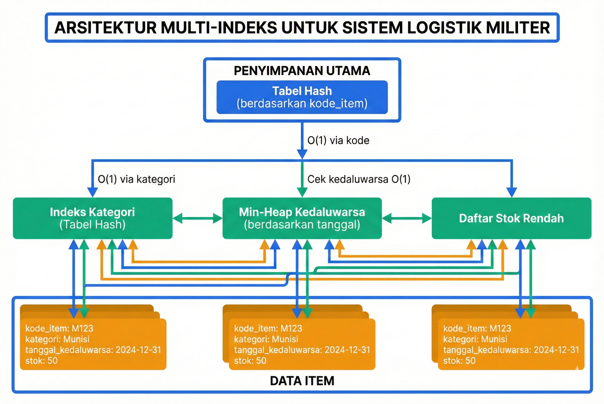

# Latihan Mandiri 15: Review dan Integrasi Struktur Data

**Mata Kuliah:** Struktur Data dan Algoritma  
**Pertemuan:** 15  
**Topik:** Review dan Integrasi Struktur Data  
**Waktu:** 150 menit  
**Sifat:** Open Book

---

## Petunjuk Pengerjaan

1. Kerjakan semua soal dengan teliti
2. Soal pilihan ganda bernilai 2 poin per soal (total 40 poin)
3. Soal uraian bernilai sesuai bobot yang tertera (total 45 poin)
4. Studi kasus bernilai 15 poin (total 15 poin)
5. Total nilai maksimum: 100 poin
6. Latihan ini merupakan persiapan UAS — pastikan memahami seluruh konsep!

---

## Bagian A: Soal Pilihan Ganda (20 Soal)

Pilih jawaban yang paling tepat untuk setiap soal berikut.

### Soal 1
Diberikan kebutuhan sistem yang memerlukan operasi pencarian berdasarkan ID dengan kompleksitas O(1) rata-rata. Struktur data manakah yang paling tepat?

A. Array terurut  
B. Linked List  
C. Binary Search Tree  
D. Hash Table  
E. Heap  

### Soal 2
Dalam implementasi LRU Cache, kombinasi struktur data yang digunakan adalah:

A. Array dan Stack  
B. Hash Table dan Doubly Linked List  
C. BST dan Queue  
D. Heap dan Array  
E. Single Linked List dan Hash Table  

### Soal 3
Manakah pernyataan yang **BENAR** tentang perbandingan Array dan Linked List?

A. Array memiliki kompleksitas O(1) untuk insert di tengah  
B. Linked List memiliki kompleksitas O(1) untuk akses berdasarkan indeks  
C. Array memiliki kompleksitas O(n) untuk akses berdasarkan indeks  
D. Linked List memiliki kompleksitas O(1) untuk insert di awal (jika sudah ada pointer ke head)  
E. Keduanya memiliki penggunaan memori yang sama  

### Soal 4
Untuk implementasi fitur Undo/Redo pada text editor, kombinasi struktur data yang paling tepat adalah:

A. Satu Queue  
B. Dua Stack  
C. Satu Array  
D. Satu Linked List  
E. Satu Heap  

### Soal 5
Perhatikan tabel kompleksitas berikut:

| Operasi | Struktur Data X |
|---------|-----------------|
| Insert  | O(log n)        |
| Delete  | O(log n)        |
| Find Min| O(1)            |
| Search  | O(n)            |

Struktur data X adalah:

A. Binary Search Tree  
B. Min-Heap  
C. Hash Table  
D. Sorted Array  
E. Queue  

### Soal 6
Manakah algoritma sorting yang memiliki kompleksitas waktu terbaik O(n) untuk data yang sudah hampir terurut?

A. Quick Sort  
B. Merge Sort  
C. Insertion Sort  
D. Heap Sort  
E. Selection Sort  

### Soal 7
Dalam sistem antrian prioritas rumah sakit, pasien dengan kondisi darurat harus dilayani terlebih dahulu. Struktur data yang paling tepat adalah:

A. Queue biasa  
B. Stack  
C. Max-Heap / Priority Queue  
D. Linked List  
E. Array  

### Soal 8
Diberikan kebutuhan untuk menyimpan data yang sering dilakukan operasi pencarian range (misal: semua data dengan nilai antara 100-200). Struktur data yang paling tepat adalah:

A. Hash Table  
B. Heap  
C. Binary Search Tree  
D. Stack  
E. Queue  

### Soal 9
Manakah pernyataan yang **SALAH** tentang Hash Table?

A. Rata-rata kompleksitas search adalah O(1)  
B. Worst case search bisa O(n) jika banyak collision  
C. Selalu menjaga urutan data berdasarkan key  
D. Membutuhkan fungsi hash yang baik  
E. Dapat menggunakan separate chaining untuk menangani collision  

### Soal 10
Untuk aplikasi yang memerlukan operasi First-In-First-Out (FIFO), struktur data yang tepat adalah:

A. Stack  
B. Queue  
C. Heap  
D. BST  
E. Hash Table  

### Soal 11
Perhatikan karakteristik berikut:
- Operasi insert: O(log n)
- Operasi delete: O(log n)
- Operasi search: O(log n)
- Data selalu terurut saat traversal inorder

Struktur data yang dimaksud adalah:

A. Heap  
B. Hash Table  
C. Binary Search Tree (balanced)  
D. Sorted Array  
E. Queue  

### Soal 12
Manakah algoritma sorting yang **TIDAK** stable?

A. Merge Sort  
B. Insertion Sort  
C. Bubble Sort  
D. Quick Sort (implementasi standar)  
E. Counting Sort  

### Soal 13
Dalam sistem navigasi GPS yang perlu menyimpan rute perjalanan dan memungkinkan kembali ke titik sebelumnya, struktur data yang paling cocok adalah:

A. Queue  
B. Stack  
C. Array  
D. Heap  
E. Hash Table  

### Soal 14
Diberikan n = 1.000.000 data. Manakah struktur data yang memberikan kompleksitas waktu terbaik untuk operasi pencarian?

A. Unsorted Array: O(n)  
B. Sorted Array dengan Binary Search: O(log n)  
C. Linked List: O(n)  
D. Hash Table: O(1) rata-rata  
E. B dan D sama baiknya  

### Soal 15
Untuk implementasi spell checker yang perlu mengecek apakah sebuah kata ada dalam kamus, struktur data yang paling efisien adalah:

A. Array  
B. Linked List  
C. Binary Search Tree  
D. Hash Table / Hash Set  
E. Queue  

### Soal 16
Manakah pernyataan yang **BENAR** tentang Heap Sort?

A. Memiliki worst case O(n²)  
B. Merupakan algoritma sorting yang stable  
C. Memiliki kompleksitas waktu O(n log n) untuk semua kasus  
D. Membutuhkan memori tambahan O(n)  
E. Tidak dapat dilakukan secara in-place  

### Soal 17
Dalam implementasi browser history (back/forward), struktur data yang paling tepat adalah:

A. Satu Stack  
B. Satu Queue  
C. Dua Stack  
D. Satu Linked List  
E. Hash Table  

### Soal 18
Perhatikan kriteria pemilihan berikut:
- Data perlu diakses berdasarkan posisi/indeks
- Ukuran data tetap dan diketahui
- Memory efficiency penting

Struktur data yang paling tepat adalah:

A. Linked List  
B. Array  
C. Hash Table  
D. Binary Search Tree  
E. Heap  

### Soal 19
Manakah kompleksitas waktu yang **BENAR** untuk operasi pada Doubly Linked List (dengan pointer ke node yang akan dioperasikan sudah tersedia)?

A. Delete: O(n)  
B. Insert setelah node: O(n)  
C. Delete: O(1)  
D. Traversal ke node sebelumnya: O(n)  
E. Access by index: O(1)  

### Soal 20
Untuk sistem yang memerlukan pencarian cepat DAN data terurut, kombinasi struktur data yang dapat digunakan adalah:

A. Hash Table saja  
B. Heap saja  
C. BST atau Hash Table + Sorted Structure  
D. Queue saja  
E. Stack saja  

---

## Bagian B: Soal Uraian (15 Soal)

### Soal U1 (2 poin)
Jelaskan perbedaan utama antara Stack dan Queue dalam hal urutan akses data!

### Soal U2 (2 poin)
Sebutkan 3 kriteria utama dalam memilih struktur data yang tepat untuk suatu permasalahan!

### Soal U3 (3 poin)
Lengkapi tabel perbandingan kompleksitas berikut:

| Operasi | Array (unsorted) | Linked List | Hash Table |
|---------|------------------|-------------|------------|
| Access  | ?                | ?           | ?          |
| Search  | ?                | ?           | ?          |
| Insert  | ?                | ?           | ?          |

### Soal U4 (3 poin)
Jelaskan mengapa Hash Table tidak cocok untuk operasi yang memerlukan data terurut, dan sebutkan struktur data alternatif yang lebih tepat!

### Soal U5 (3 poin)
Dalam konteks sorting, jelaskan:
a. Apa yang dimaksud dengan "stable sort"?
b. Mengapa stabilitas penting dalam beberapa kasus?
c. Sebutkan 2 contoh algoritma sorting yang stable!

### Soal U6 (3 poin)
Jelaskan bagaimana LRU Cache menggunakan kombinasi Hash Table dan Doubly Linked List untuk mencapai kompleksitas O(1) pada operasi get dan put!

### Soal U7 (3 poin)
Perhatikan skenario berikut:
- Sistem perlu menyimpan 10.000 data mahasiswa
- Operasi yang paling sering: pencarian berdasarkan NIM
- Sesekali perlu menampilkan data terurut berdasarkan IPK

Struktur data apa yang Anda rekomendasikan? Jelaskan alasannya!

### Soal U8 (3 poin)
Jelaskan trade-off antara menggunakan Array vs Linked List untuk implementasi Stack!

### Soal U9 (3 poin)
Dalam implementasi text editor dengan fitur Undo/Redo:
a. Jelaskan peran masing-masing stack!
b. Apa yang terjadi saat user melakukan aksi baru setelah beberapa kali Undo?

### Soal U10 (4 poin)
Diberikan kebutuhan sistem berikut:
- Menyimpan data sensor dengan timestamp
- Perlu mengambil data terbaru dengan cepat
- Perlu menghapus data terlama secara otomatis saat kapasitas penuh
- Perlu mencari data berdasarkan sensor ID

Rancang kombinasi struktur data yang tepat dan jelaskan alasannya!

### Soal U11 (3 poin)
Jelaskan kapan sebaiknya menggunakan:
a. Quick Sort
b. Merge Sort
c. Heap Sort

### Soal U12 (3 poin)
Perhatikan kode berikut:

```cpp
// Fungsi untuk mencari elemen dalam struktur data
int cari(int target) {
    // Implementasi A: Array terurut dengan binary search
    // Implementasi B: Hash Table
}
```

Bandingkan kedua implementasi dari segi:
a. Kompleksitas waktu rata-rata
b. Kompleksitas ruang
c. Fleksibilitas untuk operasi lain

### Soal U13 (3 poin)
Jelaskan mengapa Heap lebih cocok untuk Priority Queue dibandingkan dengan Sorted Array!

### Soal U14 (4 poin)
Rancang struktur data untuk sistem booking tiket kereta dengan kebutuhan:
- Pencarian ketersediaan kursi berdasarkan nomor gerbong: cepat
- Booking kursi: cepat
- Pembatalan booking: cepat
- Menampilkan semua kursi kosong dalam satu gerbong: efisien

Jelaskan pilihan struktur data dan kompleksitas setiap operasi!

### Soal U15 (4 poin)
Buatlah diagram decision tree sederhana untuk memilih struktur data berdasarkan karakteristik operasi yang dominan! (Dapat digambar dalam bentuk teks/pseudocode)

---

## Bagian C: Studi Kasus Pertahanan (2 Kasus)

### Studi Kasus 1: Sistem Monitoring Radar (7 poin)

**Latar Belakang:**
Pusat komando pertahanan udara memerlukan sistem monitoring radar yang dapat:
- Melacak hingga 1000 objek terbang secara simultan
- Setiap objek memiliki: ID unik, koordinat (x, y, z), kecepatan, dan tingkat ancaman (1-10)
- Update posisi setiap objek terjadi setiap 100ms
- Perlu mengidentifikasi 10 objek dengan ancaman tertinggi secara real-time
- Perlu pencarian objek berdasarkan ID dengan cepat
- Perlu menghapus objek yang keluar dari jangkauan radar

**Tugas:**

a. **(2 poin)** Rancang struktur data yang tepat untuk sistem ini! Jelaskan mengapa Anda memilih kombinasi struktur data tersebut.

b. **(2 poin)** Tuliskan pseudocode untuk operasi `getTop10Threats()` yang mengembalikan 10 objek dengan tingkat ancaman tertinggi!

c. **(3 poin)** Analisis kompleksitas waktu untuk setiap operasi utama:
- Update posisi objek
- Pencarian objek berdasarkan ID
- Mendapatkan top 10 ancaman
- Menghapus objek dari tracking

---

### Studi Kasus 2: Sistem Logistik Militer (8 poin)

**Latar Belakang:**
Divisi logistik memerlukan sistem manajemen inventaris yang dapat:
- Menyimpan data 50.000+ item peralatan militer
- Setiap item memiliki: kode item, nama, kategori, lokasi gudang, jumlah stok, tanggal kedaluwarsa (jika ada)
- Operasi yang sering dilakukan:
  - Pencarian item berdasarkan kode (sangat sering)
  - Pencarian item berdasarkan kategori (sering)
  - Update stok saat pengambilan/penambahan
  - Alert untuk item yang akan kedaluwarsa dalam 30 hari
  - Laporan item dengan stok di bawah minimum

**Tugas:**

a. **(2 poin)** Rancang arsitektur data menggunakan kombinasi struktur data yang optimal! Gambarkan diagram arsitekturnya.

b. **(2 poin)** Implementasikan fungsi `cariByKode(string kode)` dan `cariByKategori(string kategori)` dalam pseudocode!

c. **(2 poin)** Jelaskan bagaimana sistem akan menangani alert kedaluwarsa secara efisien tanpa melakukan scan seluruh data setiap hari!

d. **(2 poin)** Analisis trade-off dari desain Anda dibandingkan dengan menggunakan single data structure (misalnya hanya Array atau hanya Hash Table)!

---

## Kunci Jawaban

### Bagian A: Pilihan Ganda

| No | Jawaban | Penjelasan Singkat |
|----|:-------:|-------------------|
| 1 | D | Hash Table memberikan O(1) rata-rata untuk pencarian berdasarkan key/ID |
| 2 | B | LRU Cache menggunakan Hash Table (O(1) lookup) + Doubly Linked List (O(1) move to front/remove) |
| 3 | D | Linked List O(1) insert di awal jika pointer ke head tersedia (hanya ubah beberapa pointer) |
| 4 | B | Dua Stack: satu untuk Undo (menyimpan aksi), satu untuk Redo (aksi yang di-undo) |
| 5 | B | Min-Heap: insert/delete O(log n), find-min O(1), tapi search O(n) |
| 6 | C | Insertion Sort O(n) untuk data hampir terurut karena minimal pergeseran |
| 7 | C | Max-Heap/Priority Queue untuk mengambil elemen dengan prioritas tertinggi |
| 8 | C | BST mendukung range query dengan traversal inorder |
| 9 | C | Hash Table TIDAK menjaga urutan, data tersimpan berdasarkan hash value |
| 10 | B | Queue mengikuti prinsip FIFO (First-In-First-Out) |
| 11 | C | Balanced BST memiliki semua operasi O(log n) dan inorder traversal terurut |
| 12 | D | Quick Sort standar tidak stable (elemen equal bisa bertukar urutan) |
| 13 | B | Stack LIFO cocok untuk backtracking/kembali ke titik sebelumnya |
| 14 | D | Hash Table O(1) lebih baik dari Binary Search O(log n) untuk lookup murni |
| 15 | D | Hash Set O(1) untuk membership checking |
| 16 | C | Heap Sort O(n log n) untuk semua kasus, in-place, tapi tidak stable |
| 17 | C | Dua Stack: Back stack dan Forward stack untuk navigasi |
| 18 | B | Array: O(1) access by index, memory efficient, ukuran tetap |
| 19 | C | Doubly Linked List: Delete O(1) jika pointer ke node tersedia |
| 20 | C | BST untuk keduanya, atau Hash Table + struktur terurut terpisah |

---

### Bagian B: Soal Uraian

#### Jawaban U1

**Stack vs Queue:**
- **Stack (LIFO - Last In First Out)**: Elemen terakhir yang masuk akan keluar pertama. Seperti tumpukan piring.
- **Queue (FIFO - First In First Out)**: Elemen pertama yang masuk akan keluar pertama. Seperti antrian.

**Perbedaan utama**: Urutan pemrosesan data berlawanan — Stack memproses dari yang terbaru, Queue memproses dari yang terlama.

---

#### Jawaban U2

**3 Kriteria utama pemilihan struktur data:**

1. **Jenis operasi yang dominan**: Apakah lebih sering search, insert, delete, atau access?

2. **Kompleksitas waktu yang diperlukan**: Operasi kritis harus memiliki kompleksitas rendah (idealnya O(1) atau O(log n))

3. **Constraint memori**: Apakah memori terbatas? Apakah data perlu contiguous?

Kriteria tambahan: ukuran data, kebutuhan pengurutan, frekuensi modifikasi.

---

#### Jawaban U3

| Operasi | Array (unsorted) | Linked List | Hash Table |
|---------|------------------|-------------|------------|
| Access  | **O(1)**         | **O(n)**    | **O(1)*** |
| Search  | **O(n)**         | **O(n)**    | **O(1)*** |
| Insert  | **O(1)** amortized/O(n) | **O(1)** di posisi | **O(1)*** |

*) Rata-rata, worst case O(n)

**Catatan**: 
- Array access O(1) karena akses langsung via indeks
- Linked List harus traverse untuk akses/search
- Hash Table O(1) rata-rata dengan fungsi hash baik

---

#### Jawaban U4

**Mengapa Hash Table tidak cocok untuk data terurut:**

1. **Hash function mendistribusikan data secara acak** — tidak ada hubungan antara nilai key dan posisi penyimpanan

2. **Tidak ada operasi range query** — tidak bisa efisien mengambil data dalam rentang tertentu

3. **Traversal tidak berurutan** — iterate hash table tidak menghasilkan urutan bermakna

**Alternatif yang lebih tepat:**
- **Binary Search Tree (BST)** — inorder traversal menghasilkan data terurut
- **Sorted Array** — data tersimpan terurut, mendukung binary search
- **B-Tree** — untuk dataset besar dengan kebutuhan range query

---

#### Jawaban U5

**a. Stable Sort:**
Algoritma sorting yang mempertahankan urutan relatif elemen-elemen dengan nilai/key yang sama seperti urutan di input awal.

**b. Mengapa stabilitas penting:**
- Saat sorting multi-level (sort by nama setelah sort by umur, elemen dengan umur sama tetap terurut by nama)
- Mempertahankan hasil sorting sebelumnya
- Konsistensi output untuk input yang sama

**c. Contoh algoritma stable:**
1. **Merge Sort** — stable karena saat merge, elemen dari array kiri diambil duluan jika sama
2. **Insertion Sort** — stable karena elemen hanya bergeser jika lebih besar (bukan greater-or-equal)
3. **Bubble Sort** — stable karena swap hanya terjadi jika ada inversi strict

---

#### Jawaban U6

**LRU Cache dengan Hash Table + Doubly Linked List:**

**Struktur:**
- **Hash Table**: Menyimpan mapping key → pointer ke node di Linked List
- **Doubly Linked List**: Menyimpan data aktual, head = most recently used, tail = least recently used

**Operasi GET(key):**
1. Hash Table lookup O(1) → dapat pointer ke node
2. Move node ke head O(1) (update beberapa pointer)
3. Return value

**Operasi PUT(key, value):**
1. Jika key ada: update value, move to head O(1)
2. Jika key tidak ada:
   - Buat node baru, insert di head O(1)
   - Tambah ke Hash Table O(1)
   - Jika kapasitas penuh: hapus tail O(1), hapus dari Hash Table O(1)

**Semua operasi O(1)** karena tidak ada traversal — semua akses langsung via pointer.

---

#### Jawaban U7

**Rekomendasi: Hash Table + BST (atau Skip List)**

**Alasan:**
1. **Hash Table dengan NIM sebagai key**: 
   - Pencarian berdasarkan NIM O(1)
   - Ini adalah operasi paling sering

2. **BST dengan IPK sebagai key** (atau secondary index):
   - Untuk menampilkan data terurut berdasarkan IPK
   - Inorder traversal O(n) menghasilkan data terurut

**Alternatif praktis:** 
Gunakan Hash Table saja untuk operasi sehari-hari, lalu sort on-demand saat perlu tampilan terurut (sorting 10.000 data dengan O(n log n) masih cukup cepat jika tidak terlalu sering).

---

#### Jawaban U8

**Trade-off Array vs Linked List untuk Stack:**

| Aspek | Array-based Stack | Linked List Stack |
|-------|-------------------|-------------------|
| **Push** | O(1) amortized* | O(1) always |
| **Pop** | O(1) | O(1) |
| **Memory** | Contiguous, mungkin ada waste | Per-node overhead (pointer) |
| **Resizing** | Perlu realokasi jika penuh | Tidak perlu |
| **Cache** | Cache-friendly | Cache-unfriendly |
| **Max size** | Perlu diketahui/dynamic | Unlimited (sesuai memori) |

*) Amortized O(1) dengan strategi doubling

**Rekomendasi:**
- **Array**: Jika ukuran maksimum diketahui atau cache performance penting
- **Linked List**: Jika ukuran sangat dinamis atau memory fragmentation tidak masalah

---

#### Jawaban U9

**a. Peran masing-masing Stack:**

- **Undo Stack**: Menyimpan semua aksi yang dilakukan user (dalam urutan kronologis)
- **Redo Stack**: Menyimpan aksi yang sudah di-undo (untuk memungkinkan redo)

**Operasi:**
- User action → push ke Undo Stack
- Undo → pop dari Undo Stack, push ke Redo Stack, reverse aksi
- Redo → pop dari Redo Stack, push ke Undo Stack, apply aksi

**b. Aksi baru setelah beberapa Undo:**
- **Redo Stack di-clear (dikosongkan)**
- Aksi baru di-push ke Undo Stack
- Alasan: Timeline baru "bercabang" — aksi yang di-undo tidak lagi relevan karena state sudah berubah

---

#### Jawaban U10

**Desain untuk Sistem Data Sensor:**

**Kombinasi struktur data:**
1. **Hash Table**: key = sensor_id → pointer ke node
2. **Doubly Linked List**: ordered by timestamp (head = newest)
3. **Optional: Min-Heap** by timestamp untuk delete terlama

**Cara kerja:**
- **Insert data baru**: 
  - Add ke head Linked List O(1)
  - Add ke Hash Table O(1)
  - Jika penuh: hapus dari tail O(1), hapus dari Hash Table O(1)

- **Cari by sensor ID**:
  - Hash Table lookup O(1)

- **Hapus data terlama**:
  - Remove tail dari Linked List O(1)
  - Remove dari Hash Table O(1)

**Alasan:** Mirip LRU Cache tetapi ordered by timestamp bukan by access time.

---

#### Jawaban U11

**Kapan menggunakan masing-masing sorting:**

**a. Quick Sort:**
- Data random dengan ukuran besar
- Memory terbatas (in-place)
- Rata-rata cepat O(n log n)
- **Hindari jika**: data hampir terurut (worst case O(n²))

**b. Merge Sort:**
- Perlu algoritma stable
- Data di external storage (merge-friendly)
- Worst case guarantee penting O(n log n)
- **Hindari jika**: memory terbatas (butuh O(n) extra)

**c. Heap Sort:**
- Perlu worst case O(n log n) dan in-place
- Memory sangat terbatas
- **Hindari jika**: perlu stable sort atau cache performance kritis

---

#### Jawaban U12

**Perbandingan Array Terurut (Binary Search) vs Hash Table:**

**a. Kompleksitas waktu rata-rata:**
- Binary Search: **O(log n)**
- Hash Table: **O(1)**
→ Hash Table lebih cepat untuk lookup murni

**b. Kompleksitas ruang:**
- Binary Search: **O(n)** (hanya data)
- Hash Table: **O(n)** tetapi dengan overhead untuk buckets dan handling collision
→ Array lebih memory-efficient

**c. Fleksibilitas untuk operasi lain:**
- Binary Search: Mendukung **range query**, **find min/max O(1)**, **predecessor/successor**
- Hash Table: **Tidak mendukung** operasi terurut, range query, atau ordered traversal
→ Array terurut lebih fleksibel untuk operasi berbasis urutan

---

#### Jawaban U13

**Heap vs Sorted Array untuk Priority Queue:**

| Operasi | Heap | Sorted Array |
|---------|------|--------------|
| Insert | **O(log n)** | O(n) |
| Extract-Min/Max | **O(log n)** | O(1)* atau O(n)** |
| Find-Min/Max | O(1) | O(1) |

*) O(1) jika hapus dari ujung
**) O(n) jika perlu shift

**Mengapa Heap lebih cocok:**
1. **Insert lebih cepat**: Priority Queue sering melakukan insert, Heap O(log n) vs Array O(n)
2. **Balance operasi**: Heap memberikan O(log n) untuk insert DAN delete
3. **Dynamic**: Tidak perlu menjaga seluruh array terurut

**Sorted Array hanya lebih baik jika:** Insert sangat jarang, atau selalu hapus dari ujung.

---

#### Jawaban U14

**Struktur data untuk sistem booking tiket:**

**Arsitektur:**
```
Main: Hash Table
  key: nomor_gerbong
  value: BitArray/BitSet untuk kursi (1 = booked, 0 = available)
```

**Operasi dan kompleksitas:**

1. **Pencarian ketersediaan kursi**:
   - `hashTable[gerbong][kursi]` → **O(1)**

2. **Booking kursi**:
   - Set bit ke 1 → **O(1)**

3. **Pembatalan booking**:
   - Set bit ke 0 → **O(1)**

4. **Semua kursi kosong dalam gerbong**:
   - Scan BitArray → **O(k)** dimana k = jumlah kursi per gerbong (konstanta)
   - Atau gunakan auxiliary count → **O(1)** untuk jumlah saja

**Alternatif:** Hash Table of Hash Sets, dimana inner set menyimpan kursi yang terbooked.

---

#### Jawaban U15

**Decision Tree Pemilihan Struktur Data:**

```
START: Apa operasi yang paling sering?
│
├─► Pencarian berdasarkan key/ID
│   └─► Hash Table ✓
│
├─► Akses berdasarkan posisi/indeks
│   └─► Array ✓
│
├─► Insert/Delete di awal atau akhir
│   ├─► Perlu LIFO? → Stack (Array atau Linked List) ✓
│   └─► Perlu FIFO? → Queue ✓
│
├─► Insert/Delete di tengah (posisi arbitrary)
│   └─► Linked List ✓
│
├─► Perlu data terurut ATAU range query?
│   ├─► Ya, dan insert/delete sering → BST ✓
│   └─► Ya, tapi data statis → Sorted Array ✓
│
├─► Perlu mengambil elemen dengan prioritas (min/max)
│   └─► Heap / Priority Queue ✓
│
└─► Kombinasi kebutuhan kompleks
    └─► Gunakan MULTIPLE struktur data (indexing) ✓
```

---

### Bagian C: Studi Kasus

#### Studi Kasus 1: Sistem Monitoring Radar

**a. Rancangan Struktur Data:**

**Kombinasi:**
1. **Hash Table**: 
   - Key: object_id 
   - Value: pointer ke node dengan data lengkap
   - Fungsi: Pencarian cepat O(1) berdasarkan ID

2. **Max-Heap**: 
   - Key: threat_level
   - Value: object data atau pointer
   - Fungsi: Mendapatkan top-k ancaman dengan cepat

3. **Doubly Linked List** (optional): 
   - Untuk tracking urutan update atau LRU-style removal

**Alasan kombinasi:**
- Hash Table untuk lookup O(1) — penting untuk update posisi 1000 objek setiap 100ms
- Max-Heap untuk ekstraksi top-k ancaman O(k log n) — real-time threat assessment
- Setiap objek disimpan sekali, dengan pointer dari multiple struktur

---

**b. Pseudocode getTop10Threats():**

```
function getTop10Threats():
    // Asumsi menggunakan Max-Heap berdasarkan threat_level
    result = empty list
    tempHeap = copy(threatHeap)  // Preserve original
    
    count = 0
    while count < 10 AND tempHeap not empty:
        topThreat = extractMax(tempHeap)
        result.append(topThreat)
        count++
    
    return result
    
// Kompleksitas: O(k log n) dimana k = 10
```

**Alternatif lebih efisien (tanpa modifikasi heap):**
```
function getTop10Threats():
    // Gunakan partial heap extraction atau selection algorithm
    // Atau maintain separate "top-k" structure yang di-update saat insert
    return topKList  // O(1) jika pre-maintained
```

---

**c. Analisis Kompleksitas:**

| Operasi | Struktur Data | Kompleksitas | Penjelasan |
|---------|---------------|--------------|------------|
| **Update posisi** | Hash Table | **O(1)** | Lookup ID, update koordinat |
| **Pencarian by ID** | Hash Table | **O(1)** | Direct hash lookup |
| **Top 10 ancaman** | Max-Heap | **O(k log n)** | Extract 10 elemen dari heap |
| **Hapus objek** | Hash Table + Heap | **O(log n)** | O(1) dari Hash, O(log n) dari Heap |

**Catatan untuk Top 10:**
- Jika perlu lebih cepat, maintain sorted list of top-k yang di-update incrementally
- Trade-off: Update O(k) saat insert vs Query O(1)

---

#### Studi Kasus 2: Sistem Logistik Militer

**a. Arsitektur Data:**



*Gambar 15.7: Arsitektur multi-index untuk sistem logistik militer*


**Struktur:**
1. **Primary Hash Table**: key = kode_item → Item data lengkap
2. **Category Index**: Hash Table, key = kategori → List of item pointers
3. **Expiry Min-Heap**: Priority queue berdasarkan tanggal kedaluwarsa
4. **Low Stock Alert List**: Linked List atau Set untuk item di bawah minimum

---

**b. Pseudocode Pencarian:**

```cpp
// Pencarian berdasarkan kode
Item* cariByKode(string kode) {
    if (primaryHash.contains(kode)) {
        return primaryHash.get(kode);
    }
    return nullptr;  // Tidak ditemukan
}
// Kompleksitas: O(1)

// Pencarian berdasarkan kategori
List<Item*> cariByKategori(string kategori) {
    if (categoryIndex.contains(kategori)) {
        return categoryIndex.get(kategori);  // Return list of pointers
    }
    return emptyList;
}
// Kompleksitas: O(1) untuk mendapat list, O(k) untuk iterate k items
```

---

**c. Penanganan Alert Kedaluwarsa:**

**Strategi: Min-Heap + Daily Check**

```
// Struktur: Min-Heap dengan tanggal kedaluwarsa sebagai key

function dailyExpiryCheck():
    today = getCurrentDate()
    threshold = today + 30 days
    
    alerts = empty list
    
    // Peek dan extract selama item akan kedaluwarsa dalam 30 hari
    while not expiryHeap.isEmpty():
        topItem = expiryHeap.peek()
        
        if topItem.expiryDate <= threshold:
            alerts.append(topItem)
            expiryHeap.extractMin()
            // Move to "expiring soon" separate list
        else:
            break  // Semua item berikutnya expiry lebih lama
    
    return alerts
    
// Kompleksitas: O(k log n) dimana k = jumlah item yang akan expire
// TIDAK perlu scan seluruh 50.000 data!
```

**Keunggulan:**
- Hanya proses item yang relevan
- Min-Heap menjamin item dengan expiry terdekat di top
- Setelah check, item dipindah ke list terpisah (tidak perlu check ulang)

---

**d. Trade-off Analisis:**

| Aspek | Multi-Index (Desain Ini) | Single Hash Table | Single Array |
|-------|--------------------------|-------------------|--------------|
| **Cari by kode** | O(1) | O(1) | O(n) |
| **Cari by kategori** | O(1) + O(k) | O(n) scan | O(n) scan |
| **Expiry check** | O(k log n) | O(n) scan | O(n) scan |
| **Memory** | ~3x overhead | 1x | 1x |
| **Insert complexity** | O(log n) update heap | O(1) | O(1) |
| **Maintenance** | Lebih kompleks | Simple | Simple |

**Kesimpulan:**
- **Multi-index lebih baik untuk**: Sistem dengan query beragam dan performa kritis
- **Single structure lebih baik untuk**: Sistem sederhana, data kecil, atau memory terbatas
- **Trade-off utama**: Memory dan complexity vs Query performance

---

## Kriteria Penilaian

| Bagian | Jumlah Soal | Poin per Soal | Total |
|--------|-------------|---------------|-------|
| Pilihan Ganda | 20 | 2 | 40 |
| Uraian | 15 | Bervariasi (2-4) | 45 |
| Studi Kasus | 2 | 7 + 8 | 15 |
| **Total** | | | **100** |

---

## Tips Persiapan UAS

1. **Pahami trade-off** setiap struktur data, bukan hanya hafal kompleksitas
2. **Latih pemilihan** struktur data berdasarkan skenario
3. **Kuasai implementasi** dasar setiap struktur data dalam C++
4. **Pelajari kombinasi** struktur data untuk masalah kompleks
5. **Review algoritma sorting** dan kapan menggunakan masing-masing
6. **Praktikkan analisis kompleksitas** Big-O

---

## Catatan untuk Pengajar

- Latihan ini mencakup semua Sub-CPMK-7.1 dan Sub-CPMK-7.2
- Studi kasus dirancang dengan konteks pertahanan Indonesia
- Tingkat kesulitan bervariasi untuk mengakomodasi berbagai level kemampuan
- Dapat digunakan sebagai latihan persiapan UAS
- Mahasiswa disarankan mengerjakan dalam kelompok untuk diskusi

---

## License

This repository is licensed under the **Creative Commons Attribution 4.0 International (CC BY 4.0)**. Commercial use is permitted, provided attribution is given to the author.

© 2026 Anindito
